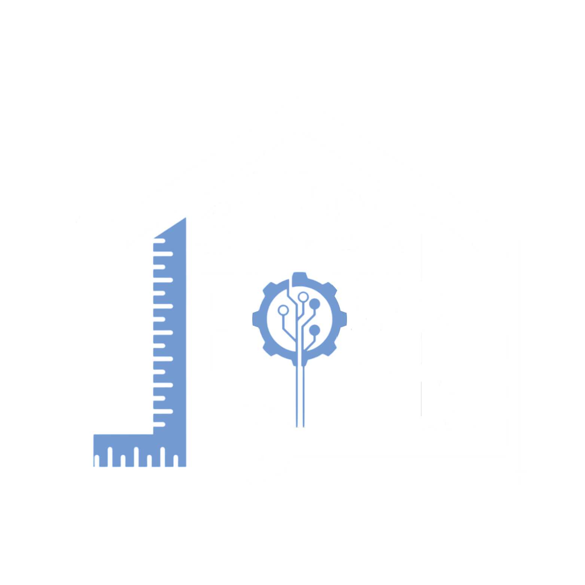

<p align="center">
  
</p>

<h1 align="center">StockFlow</h1>

<p align="center">
  Sistema de gestión y control de inventario.
</p>

<p align="center">
  
  
  
  
</p>

</p>

---
📦 Sobre StockFlow

StockFlow es una aplicación de escritorio orientada a la **gestión y control de inventario**, desarrollada inicialmente para administrar las herramientas y recursos de un pañol o taller escolar.

El sistema permite centralizar la información del inventario y gestionar de manera más organizada los recursos disponibles, sus movimientos y su estado. La aplicación utiliza una base de datos **MySQL/MariaDB** para garantizar la persistencia de la información y cuenta con un proceso de configuración automatizado para facilitar la creación inicial de la base de datos, sus tablas y la carga del inventario.

El proyecto fue diseñado inicialmente para un entorno educativo, pero su estructura busca servir como base para evolucionar hacia un sistema de inventario más flexible y adaptable a diferentes contextos.


## ⚙️ Instalación y Configuración

Sigue estos pasos para poner en marcha el entorno de desarrollo en tu máquina local.

### 1. Clonar el repositorio

```bash
git clone https://github.com/pERSA7/StockFlow.git
cd stockflow
```

### 2. Crear y activar un entorno virtual

**En Windows (PowerShell):**

```powershell
python -m venv venv
.\venv\Scripts\Activate.ps1
```

**En Linux / macOS:**

```bash
python3 -m venv venv
source venv/bin/activate
```

### 3. Instalar las dependencias

```bash
pip install -r requirements.txt
```

---

## 🗄️ Configuración de la Base de Datos (MySQL / MariaDB)

El sistema requiere un servidor **MySQL o MariaDB** ejecutándose localmente o de forma remota.

### 1. Configurar las credenciales (`.env`)

El proyecto utiliza variables de entorno para proteger las credenciales de la base de datos.

Primero, copia el archivo de ejemplo `.env.example` y renómbralo a `.env`.

**En Linux / macOS:**

```bash
cp .env.example .env
```

**En Windows:**

```cmd
copy .env.example .env
```

Luego, abre el archivo `.env` y completa tus datos de conexión:

```env
DB_HOST=localhost
DB_USER=tu_usuario
DB_PASSWORD=tu_contraseña
DB_NAME=db_stockflow
DB_PORT=3306
```

> ⚠️ **Importante:** El archivo `.env` contiene información sensible y no debe subirse al repositorio. Asegúrate de incluirlo en el archivo `.gitignore`.

### 2. Configurar el script de inicialización (`.env.setup`)

El script automatizado de creación de la base de datos utiliza `.env.setup` para conectarse a MySQL con un usuario que tenga permisos de administrador o permisos para crear bases de datos.

Configura las credenciales necesarias:

```env
DB_HOST=localhost
DB_USER=usuario_administrador
DB_PASSWORD=tu_contraseña
DB_NAME=db_stockflow
DB_PORT=3306
```

Luego, ejecuta el script de configuración inicial:

```bash
python paniol/setup/db_setup.py
```

Este proceso creará automáticamente:

- La base de datos.
- Las tablas necesarias.
- Las restricciones y relaciones.
- El inventario inicial a partir de los archivos CSV.

---

## 🚀 Ejecución de la Aplicación

Una vez configurado el entorno virtual y la base de datos, puedes iniciar la aplicación de escritorio.

### Mediante el módulo principal

```bash
python -m paniol
```

### Mediante el script lanzador

```bash
python run.py
```